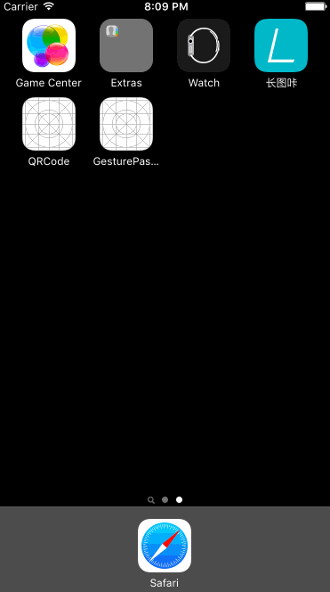

# 手势密码解锁

## 项目介绍
本项目是一个Swift手势解锁的项目。

## 使用
将项目下的文件夹GesturePassword拷贝到自己的项目中。

GesturePasswdWindow类继承UIWindow。

GesturePasswdWindowdegelete是他的代理协议，包含三个方法，都需要实现。

## 联系我
博客地址：[秃萝卜-http://www.tuluobo.com](http://www.tuluobo.com)

欢迎一起交流。
